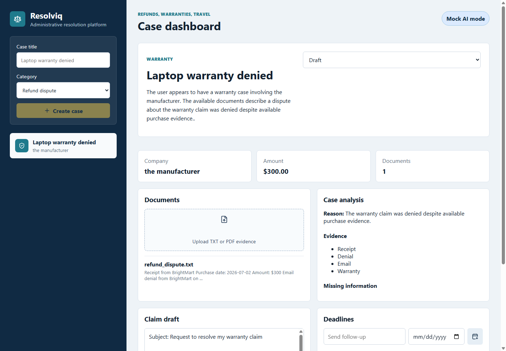

# Resolviq

Resolviq is a full-stack AI Administrative Resolution Platform that turns unstructured consumer documents into organized dispute cases and helps users generate and track claims for refunds, warranties, and travel issues.

The project is intentionally straightforward so it is easy to explain in an interview:

- React dashboard for creating and managing cases.
- FastAPI backend for case, document, status, and deadline endpoints.
- PostgreSQL for users, cases, documents, deadlines, and extracted case data.
- PDF/text upload support.
- Pydantic validation for structured AI output.
- Known-answer evaluation dataset for company, amount, date, claim type, and reason extraction.
- Optional demo API-key auth boundary for deployed demos.
- Deployment blueprint for React, FastAPI, and PostgreSQL.
- Mock AI mode by default, with an OpenAI-backed abstraction ready for a real key.
- Automated tests for creation, validation, invalid input, and document workflow.

## What the app does

1. A user creates a case and chooses one of three categories: refund, warranty, or travel.
2. The user uploads a receipt, denial email, plain text file, or PDF.
3. The backend extracts document text.
4. The AI service returns structured fields: summary, company, disputed amount, important dates, dispute reason, evidence, and missing information.
5. Pydantic validates the structured output.
6. The backend stores the case data.
7. The dashboard displays an organized case view and generates an editable claim draft.
8. The user tracks status and deadlines.

## Folder structure

```text
resolviq/
  backend/
    app/
      api/          FastAPI routes
      core/         settings
      db/           database session and initialization
      models/       SQLAlchemy database models
      schemas/      Pydantic request/response and AI schemas
      services/     AI abstraction and PDF/text extraction
    tests/          backend tests
    demo_files/     sample upload documents
  frontend/
    src/
      api/          browser API client
      components/   dashboard components
      types/        TypeScript data types
  docs/
    interview-prep.md
  docker-compose.yml
```

## Setup

Use Python 3.11, 3.12, or 3.13 for the backend. Python 3.14 may require local build tools for some validation dependencies while ecosystem wheels catch up.

### 1. Start PostgreSQL

```bash
docker compose up -d
```

### 2. Configure backend environment

```bash
cd backend
copy .env.example .env
```

Mock AI is enabled by default:

```env
AI_PROVIDER=mock
```

That means the app runs without a paid API key. If you later add an OpenAI key, set:

```env
AI_PROVIDER=openai
OPENAI_API_KEY=your_key_here
```

### 3. Run the backend

```bash
cd backend
python -m venv .venv
.venv\Scripts\activate
pip install -r requirements.txt
python -m app.db.init_db
uvicorn app.main:app --reload
```

Backend URL:

```text
http://localhost:8000
```

API docs:

```text
http://localhost:8000/docs
```

### 4. Run the frontend

Open a second terminal:

```bash
cd frontend
npm install
npm run dev
```

Frontend URL:

```text
http://localhost:5173
```

## Try the demo workflow

1. Open the frontend.
2. Create a refund, warranty, or travel case.
3. Upload `backend/demo_files/refund_dispute.txt`.
4. Review the extracted company, amount, evidence, missing information, and generated claim draft.
5. Add a deadline and change the status.

## Demo Screenshot



## Tests

From `backend/`:

```bash
pytest
```

Covered behavior:

- Case creation.
- Invalid category rejection.
- Structured AI output validation.
- Document upload and case analysis workflow.

## Measured Evaluation

Local benchmark completed on 2026-09-23 with `backend/scripts/benchmark_extraction.py`. Raw evidence is saved in `backend/evaluation/results/`.

| Documents | Categories | Field checks | Field-extraction accuracy | Validation success rate | Average processing time |
| ---: | --- | ---: | ---: | ---: | ---: |
| 45 | refund, warranty, travel | 180 | 83.3% | 100.0% | 0.056 ms/document |

Classification accuracy is not reported because Resolviq does not currently implement autonomous document classification; users choose `refund`, `warranty`, or `travel` before analysis. That is a product boundary, not a measured classifier result.

Evidence files:

- `backend/evaluation/results/resolviq_extraction_summary.json`
- `backend/evaluation/results/resolviq_extraction_benchmark.csv`

## Design choices

This project avoids unnecessary sophistication on purpose. There is no complex auth system, background queue, vector database, or multi-agent architecture. The goal is to show a clean full-stack workflow a CS student can explain clearly:

- API receives a document.
- Text extraction converts it into plain text.
- AI service returns structured data.
- Pydantic validates the structure.
- SQLAlchemy stores it in PostgreSQL.
- React displays the result.

## Interview Proof

The repo includes:

- backend workflow tests in `backend/tests/`
- frontend build verification through CI
- a backend Dockerfile in `backend/Dockerfile`
- GitHub Actions checks in `.github/workflows/ci.yml`
- deployed-app verification in `.github/workflows/deploy-verification.yml`
- deployment blueprint in `render.yaml`
- an interview-safe proof guide in `docs/interview-proof.md`
- deployment proof notes in `docs/deployment-proof.md`
- deployed auth verification notes in `docs/deployed-auth-verification.md`
- security boundaries in `docs/security-notes.md`
- structured extraction evaluation in `docs/evaluation-dataset.md`

Default AI mode is `mock`, which makes the app reliable for demos and tests. OpenAI mode is optional and should be described as an integration path, not as required for the core demo.

## Resume-safe claims

Every claim below is supported by the code:

- Built a React and FastAPI full-stack application.
- Added an optional demo authentication boundary between the React app and API.
- Added deployment files for a React frontend, FastAPI backend, and PostgreSQL database.
- Added a deployed-flow verifier that checks health, API-key rejection, authorized case creation, authorized case listing, and frontend loading.
- Implemented document upload and PDF/text extraction.
- Designed SQLAlchemy models for users, cases, documents, deadlines, and structured case fields.
- Used Pydantic to validate structured AI output.
- Added known-answer extraction checks for company, amount, date, claim type, and reason.
- Added a mock AI fallback so the app runs without paid API access.
- Added automated backend tests for core workflows.
- Provided Docker Compose for local PostgreSQL.

Resume-ready quantified bullet:

- Built a React/FastAPI administrative-claims workflow that processed 45 known-answer refund, warranty, and travel documents with 83.3% field-extraction accuracy and 100.0% Pydantic validation success, as measured by `backend/scripts/benchmark_extraction.py`, by combining text/PDF ingestion, structured AI output validation, SQLAlchemy storage, and a mock-AI fallback.
